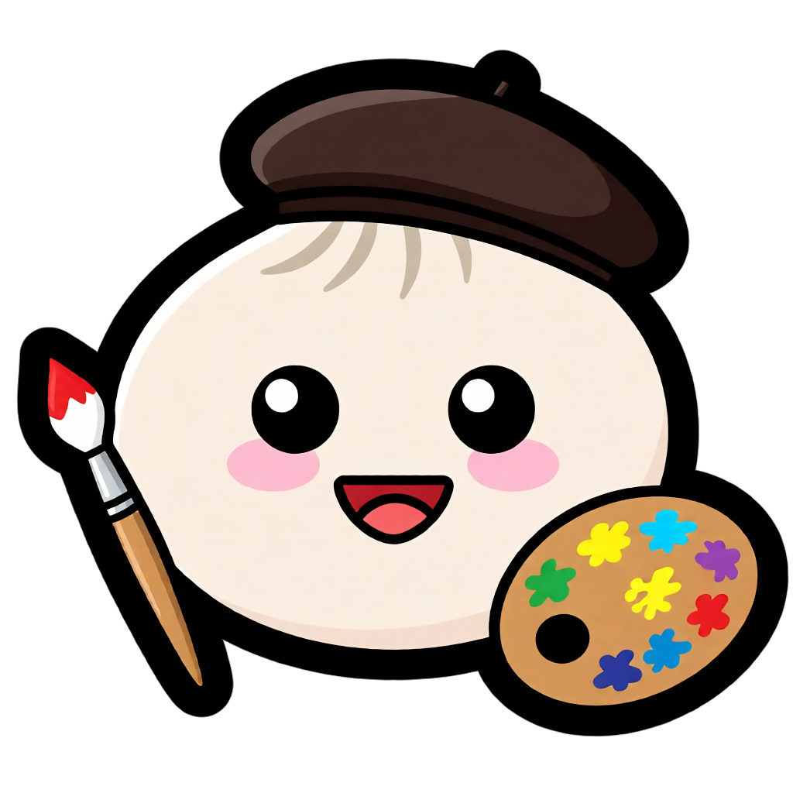

<p align="center">
  
</p>

# BunCanvas

**BunCanvas** is a project focused on bringing the full **HTML Canvas API** to non-browser environments, with a strong emphasis on **1:1 compatibility** with the browser implementation. Designed for the [Bun runtime](https://bun.sh), BunCanvas enables developers to create, render, and manipulate 2D graphics using the same familiar Canvas interfaces—such as `CanvasRenderingContext2D`, paths, transforms, compositing, text rendering, and pixel operations—without relying on a web browser. Its goal is to provide predictable, standards-aligned behavior so existing browser-based canvas code can run with minimal or no modifications, making BunCanvas suitable for native desktop applications, image generation pipelines, and graphics-heavy tooling.

The project relies on [Google Skia](https://github.com/google/skia), being the graphics engine used on google chrome for its use on canvas

This proyect is still in its early infancy, and it core methods from the current canvas implementation are still missing.

<br>
<br>
<br>

## How to build and run (Linux)
Install depot_tools on your system to build google skia, make sure to add /opt/depot_tools to your PATH. Depending on your system and desktop environment, you will need to adjust the build arguments
``` sh
$ sudo mkdir -p /opt/depot_tools
$ sudo chown -R $USER:$USER /opt/depot_tools
$ git clone https://chromium.googlesource.com/chromium/tools/depot_tools.git /opt/depot_tools
```

The following packages are needed in your system to build skia. Install them using your package manager
```
gn ninja
```

Inside CPPCanvas/Thirdparty run the following:
``` sh
$ mkdir -p skia_build && cd skia_build
$ fetch skia
$ cd skia
$ python3 tools/git-sync-deps
$ gn gen out/Release --args='is_official_build=true skia_use_system_expat=false skia_use_system_icu=false skia_use_gl=true skia_enable_ganesh=true skia_use_egl=true'
$ ninja -C out/Release
```
After doing the previous steps, the environment is ready for development. Run `build.sh` to generate the `.so` library and test by running `./run.sh`

<br>
<br>
<br>

## How to build and run (MacOS)
Install depot_tools on your system to build google skia, make sure to add /opt/depot_tools to your PATH. Depending on your system and desktop environment, you will need to adjust the build arguments
``` sh
$ sudo mkdir -p /opt/depot_tools
$ sudo chown -R $USER:$USER /opt/depot_tools
$ git clone https://chromium.googlesource.com/chromium/tools/depot_tools.git /opt/depot_tools
```

The following packages are needed in your system to build skia. Install them using brew
```
libpng glfw
```
Inside CPPCanvas/Thirdparty run the following:

### For x64 (tested)
``` sh
$ mkdir -p skia_build && cd skia_build
$ fetch skia
$ cd skia
$ python3 tools/git-sync-deps
$ gn gen "out/$(uname -o)_$(uname -m)" --args='is_debug = false skia_use_system_expat = false skia_use_system_icu = false skia_use_gl = true skia_use_metal = false skia_use_vulkan = false target_cpu = "x64" skia_use_system_expat = false skia_use_system_icu = false skia_use_system_libpng = false skia_use_system_zlib = false skia_use_system_libjpeg_turbo = false'
$ ninja -C "out/$(uname -o)_$(uname -m)"
```
<br>

### For Apple Silicon (EXPERIMENTAL - Untested)

``` sh
$ mkdir -p skia_build && cd skia_build
$ fetch skia
$ cd skia
$ python3 tools/git-sync-deps
$ gn gen "out/$(uname -o)_$(uname -m)" --args='is_debug = false skia_use_system_expat = false skia_use_system_icu = false skia_use_gl = true skia_use_metal = false skia_use_vulkan = false target_cpu = "arm64" skia_use_system_expat = false skia_use_system_icu = false skia_use_system_libpng = false skia_use_system_zlib = false skia_use_system_libjpeg_turbo = false'
$ ninja -C "out/$(uname -o)_$(uname -m)"
```

After doing the previous steps, the environment is ready for development. Run `build.sh` to generate the `.so` library and test by running `./run.sh`

<br>
<br>
<br>

## License & Third-Party Components

### BunCanvas License

BunCanvas is licensed under the Apache License 2.0.

See the LICENSE file for full details.


## Third-Party Dependencies

This project uses several third-party components that are not part of BunCanvas and are licensed separately:

### Google Skia

Skia is used as the underlying graphics engine.

- License: BSD-style (Skia project license)
- Source: https://github.com/google/skia

You are responsible for complying with Skia’s license terms when building or distributing.

## System Libraries

The following system-provided libraries are used at runtime or build time:
- OpenGL (GL)
- EGL
- pthread
- dl
- m

These are typically provided by the operating system and are not redistributed by this project.

## Other Dependencies

Additional libraries may include:

GLFW
FreeType
fontconfig
libjpeg

Each is governed by its respective license. See THIRD_PARTY_LICENSES.txt for full details.

----
## Build Notice

Building BunCanvas requires downloading and compiling Skia and other dependencies. These dependencies are governed by their own licenses and are not redistributed as part of this repository.