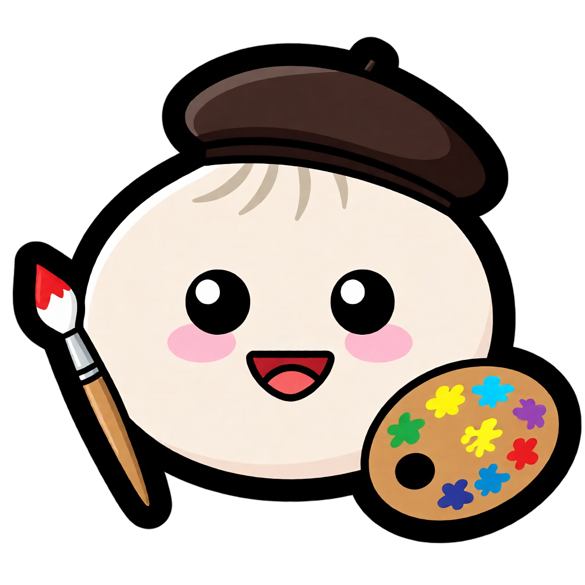

<<<<<<< HEAD

=======
<p align="center">
  
</p>
>>>>>>> dd45a6c (Changes to README.md and cleanup)

# BunCanvas

**BunCanvas** is a project focused on bringing the full **HTML Canvas API** to non-browser environments, with a strong emphasis on **1:1 compatibility** with the browser implementation. Designed for the [Bun runtime](https://bun.sh), BunCanvas enables developers to create, render, and manipulate 2D graphics using the same familiar Canvas interfaces—such as `CanvasRenderingContext2D`, paths, transforms, compositing, text rendering, and pixel operations—without relying on a web browser. Its goal is to provide predictable, standards-aligned behavior so existing browser-based canvas code can run with minimal or no modifications, making BunCanvas suitable for native desktop applications, image generation pipelines, and graphics-heavy tooling.

<<<<<<< HEAD
This proyect is still in its infancy, and it can barely render things on screen.
=======
This proyect is still in its infancy, and it can barely render stuff on screen.

## How to build and run (Linux only)
Clone the nanovg repo and place it under CPPCanvas/Thirdparty:
``` sh
$ git clone https://github.com/memononen/nanovg CPPCanvas/ThirdParty/nanovg-master
```

Download GLAD with the following options: (Language: C/C++, Specification: OpenGL, API: gl 3.3, Profile: Core) and extract its contents into CPPCanvas/Thirdparty/glad
[GLAD Download Page](https://glad.dav1d.de/)

Run the build script:
``` sh
# Run the build script, the build will be saved to build
$ ./build.sh build/BunCanvas_Linux_x64.so
```
>>>>>>> dd45a6c (Changes to README.md and cleanup)
